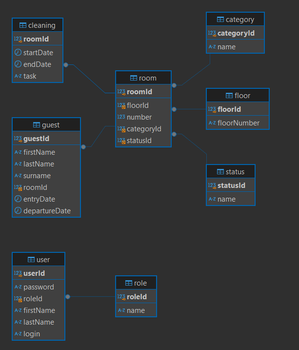

<table style="width: 100%;">
  <tr>
    <td style="text-align: center; border: none;"> 
      Министерство образования и науки РФ <br/>
      ГБПОУ РМЭ "Йошкар-Олинский Технологический колледж 
    </td>
  </tr>
  <tr>
    <td style="text-align: center; border: none; height: 10em;">
      <h2>
        Предварительное задание демо-экзамена 2025 года <br/>
      </h2>
    </td>
  </tr>
  <tr>
    <td style="text-align: right; border: none; height: 20em;">
      <div style="float: right;" align="left">
        <b>Разработал</b>: <br/>
        Карпов Максим Олегович
      </div>
    </td>
  </tr>
  <tr>
    <td style="text-align: center; border: none; height: 5em;">
      г.Йошкар-Ола, 2024
    </td>
  </tr>
</table>


### Модуль № 1: Проектирование и разработка информационных систем
[ERD.pdf](/data/ERD.drawio.pdf)

### Модуль № 2: Соадминистрирование баз данных и серверов
Запрос:

```sql
SELECT
	(SELECT COUNT(statusId) FROM room WHERE statusId = 1) / COUNT(statusId) * 100 as load_percentage
FROM
	room 
```
Результат:

| load_percentage |
| --------------- | 
| 68              | 




### Модуль № 3: Проектирование и разработка информационных систем


### Модуль № 4: Осуществление интеграции программных модулей